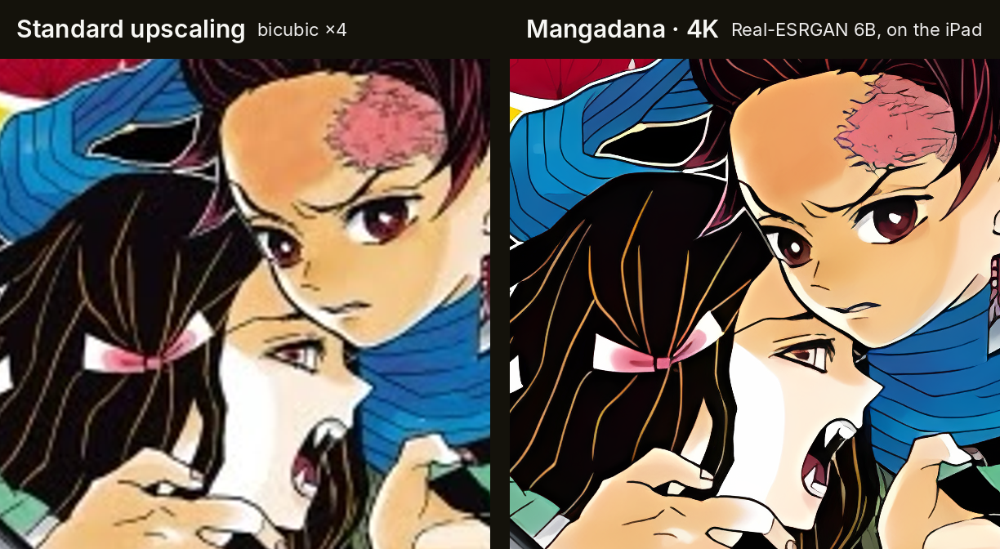
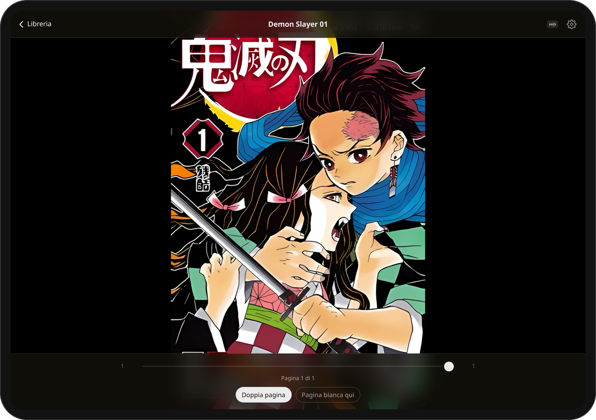
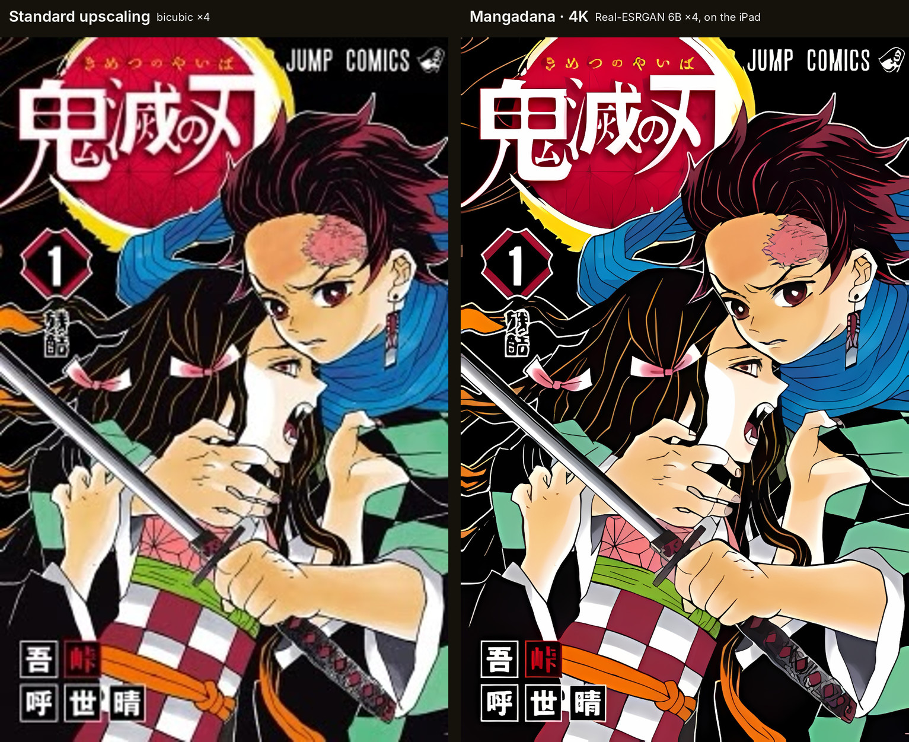

<p align="center">
  <a href="https://www.manga-dana.com">
    <picture>
      <source media="(prefers-color-scheme: dark)" srcset="https://raw.githubusercontent.com/gianmarcocherubini/Mangadana/main/public/brand/wordmark-dark.png">
      
    </picture>
  </a>
</p>

<p align="center">
  <strong>A high-resolution manga reader for iPad. Runs in your browser, upscales with AI on your GPU.</strong><br>
  Import CBZ/CBR files, read offline, and watch every page get sharper as you read — no App Store, no account, no server.
</p>

<p align="center">
  <a href="https://www.manga-dana.com"><strong>Open the app → www.manga-dana.com</strong></a>
</p>

<p align="center">
  <a href="https://github.com/gianmarcocherubini/Mangadana/actions/workflows/deploy.yml"></a>
  <a href="LICENSE"></a>
  
</p>

<p align="center">
  
</p>

<p align="center"><sub>The same 252 × 396 px JPEG cover, viewed at 4×. Left: what a browser shows you. Right: Mangadana's 4K mode (Slow · best), computed on the device.<br>Demon Slayer: Kimetsu no Yaiba © Koyoharu Gotouge / Shueisha — cover used for demonstration only.</sub></p>

## Why Mangadana

Most manga scans are small, soft, and full of JPEG artefacts, and a Retina iPad shows every flaw. Mangadana runs neural super-resolution on the iPad's GPU **while you read**: the page in front of you is upscaled ×4 by [Real-ESRGAN](https://github.com/xinntao/Real-ESRGAN) (or by [Anime4K](https://github.com/bloc97/Anime4K) in the lighter HD mode) and then fitted to the screen with a high-quality resampler. Lines come out clean, screentones stay screentones, small text becomes readable.

Everything happens in the browser, on your device. There is no server: your files never leave the iPad.

- **AI super-resolution, on the device.** *HD* (Anime4K) takes well under half a second per page. *4K* runs Real-ESRGAN, ported by hand to WebGPU compute shaders, with three levels ordered by quality: **Fast** (~1 s), **Medium** (~4 s), **Slow · best** (~7 s per page on an M-series iPad). Only the pages on screen are processed; nothing is queued, nothing is uploaded.
- **Made for manga.** Right-to-left by default, smart double pages (wide spreads and the cover stay alone), a *blank page here* fix when a volume's pairs are misaligned, an adjustable gutter, pinch and double-tap zoom, four fit modes, page-turn transitions, full screen while reading.
- **A real library.** Collections with icons, a *Continue reading* shelf, search, reading-state filters and sorting, cover search on Open Library and AniList (only with your consent), and a one-file backup of everything you have added.
- **Your files stay yours.** Archives up to 10 GB each are copied into the app's own storage and work offline, with the iPad's full quota. Passwords of protected ZIPs are kept in memory only. No account, no telemetry.
- **Installable.** Open the site in Safari and *Add to Home Screen*: a full-screen app with its own icon and splash screen that updates itself.

<p align="center">
  
</p>

## Get started

1. On your iPad, open **[www.manga-dana.com](https://www.manga-dana.com)** in Safari.
2. Tap **Share → Add to Home Screen**.
3. Open Mangadana from the Home Screen and tap **Importa** to add `.cbz` / `.cbr` files from Files, iCloud Drive or a USB drive. Import from the installed app: it has its own storage, separate from Safari's.

**Requirements.** An iPad on iPadOS 26 or later for WebGPU (HD and 4K modes). iPadOS 17 and 18 get the HD mode through WebGL2. Chrome and Edge on the desktop work too. The interface is currently in Italian.

## Super-resolution

| Mode | Network | Passes | Per page (iPad M-series) |
| --- | --- | --- | --- |
| **HD** (default) | Anime4K Upscale CNN ×2, level and factor chosen automatically | 1–2 | < 0.5 s |
| **4K · Fast** | Real-ESRGAN anime video v3 | 1 | ~1 s |
| **4K · Medium** | Real-ESRGAN anime video v3, 4-pass self-ensemble | 4 | ~4 s |
| **4K · Slow · best** | Real-ESRGAN x4plus anime 6B | 1 | ~7 s |

Both networks are implemented directly in WGSL and run through WebGPU (no ONNX runtime, no WebAssembly). Pages are upscaled at a fixed factor (×4, or ×2 when the result would exceed Safari's canvas limits) and then fitted to the screen with a Lanczos resampler, so zooming never recomputes anything and downscaling a ×4 result to screen pixels is what makes the lines look clean. On first use the app measures your GPU and picks the fastest convolution kernel for it. In 4K mode an *anti-spoiler* blur can hide the plain page until its enhanced version is ready.

<p align="center">
  
</p>

The numbers above are measurements on an iPad with an M-series chip; older iPads are slower, and the app falls back to HD when a page would take too long. The WebGPU kernels are verified against a float32 reference implementation of both networks, which in turn reproduces the PyTorch models to within 2/255 on the test fixtures. The images on this page were produced with that reference, from the very weights shipped in the app.

## Formats

| Format | Support |
| --- | --- |
| CBZ / ZIP, including ZIP64 | Yes. Entries are read straight from the file, never loaded whole into memory. |
| Password-protected ZIP | Yes: AES and ZipCrypto. The app asks for the password and asks again if it is wrong. |
| CBR / RAR 4 and RAR 5 | Yes, through unrar (WebAssembly) in a worker with windowed reads. |
| Solid or multi-volume RAR | No, with a clear message. Re-pack without the solid option. |
| Encrypted RAR, ZIP with an encrypted central directory | No, with a clear message. |
| 7z, PDF | No. |
| Page images | JPEG, PNG, GIF, WebP, BMP, AVIF, HEIC: whatever the browser can decode. |

Pages are sorted naturally (`2.jpg` before `10.jpg`), skipping `__MACOSX`, hidden files and `ComicInfo.xml`. Files up to 10 GB are supported: the import copies them into the Origin Private File System in 4 MB slices from a worker, checks the available quota first, and cleans up after itself.

## Privacy

Mangadana is a static web app: there is no backend, no account and no analytics. Your files, covers, bookmarks and settings live in the browser storage of the installed app. The only network requests besides loading and updating the app are the ones you start yourself: the optional cover search (the volume title is sent to Open Library and AniList, after an explicit consent) and the icon search for collections (Iconify). Passwords of protected archives are never written to disk.

## Backup and moving to a new iPad

The `…` button in the library exports a **backup**: a JSON file with titles, collections and their icons, chosen covers, bookmarks and reading settings. It does not contain the archives themselves. Restore it on a fresh install (or after switching iPads), import the same files again, and everything is re-attached automatically: volumes are recognised by file name and size.

## Development

```bash
npm install
npm run dev          # http://127.0.0.1:4877
npm run build        # production build with the service worker, in dist/
npm run preview      # serves dist/ on http://127.0.0.1:4878
npm test             # unit tests (Vitest)
npm run fixtures     # generates the test CBZ/CBR files in e2e/fixtures
npm run test:e2e     # end-to-end tests (Playwright; first time: npx playwright install chromium)
npm run check        # lint + typecheck + unit tests + build
```

Node 20 or later. No setup step: the Real-ESRGAN weights are in the repository (1.2 MB precached, 8.9 MB downloaded the first time *Slow* is chosen). Pushing to `main` builds, tests and deploys to GitHub Pages.

```
src/lib/archive/      format detection, ZIP reader (zip.js), RAR reader (worker + Blob-backed extractor)
src/lib/storage/      IndexedDB, OPFS, copy worker, import, thumbnails, library backup
src/lib/reader/       spread layout, LRU page cache
src/lib/upscale/      Anime4K on WebGPU and WebGL2, Real-ESRGAN in WGSL (weights, kernel generator,
                      banded runner, timing model, float32 reference and self-test)
src/components/       library, reader (gestures, toolbars, settings), brand
scripts/              test fixtures, weight conversion (PyTorch checkpoint → f16), brand assets
e2e/                  Playwright tests (chromium and webgpu projects)
docs/                 detailed documentation (Italian), feasibility study, deployment and domain notes
```

The full documentation, in Italian, is in [`docs/README.it.md`](docs/README.it.md): how every setting behaves, the super-resolution engine in depth (banded execution, f16 kernels, the Winograd experiment, verification), storage safety, GitHub Pages deployment and the custom domain.

## Credits

Mangadana stands on the work of others:

- [Real-ESRGAN](https://github.com/xinntao/Real-ESRGAN) by Xintao Wang et al. (BSD-3-Clause): the `realesr-animevideov3` and `RealESRGAN_x4plus_anime_6B` models, converted to f16 and executed in WebGPU shaders written for this app.
- [Anime4K](https://github.com/bloc97/Anime4K) by bloc97 (MIT), through [anime4k-webgpu](https://github.com/Anime4KWebBoost/Anime4K-WebGPU) and the official GLSL shaders on WebGL2.
- [zip.js](https://github.com/gildas-lormeau/zip.js), [node-unrar-js](https://github.com/YuJianrong/node-unrar.js), [idb](https://github.com/jakearchibald/idb), [Workbox](https://github.com/GoogleChrome/workbox), [Vite](https://vite.dev), [React](https://react.dev), [Tailwind CSS](https://tailwindcss.com), [Playwright](https://playwright.dev).
- The crown mark comes from the *Extras* face of [Sprite Graffiti](https://www.fontfabric.com/fonts/sprite-graffiti/) by Fontfabric, whose free-font licence permits logos and static images; the font itself is not embedded.
- The name: 漫画 *manga* + 棚 *dana* (from 本棚 *hondana*, a bookshelf). The manga shelf.

The cover shown on this page is from *Demon Slayer: Kimetsu no Yaiba* vol. 1 © Koyoharu Gotouge / Shueisha, used only to demonstrate the upscaling. The app ships no manga.

## License

[Apache License 2.0](LICENSE).
